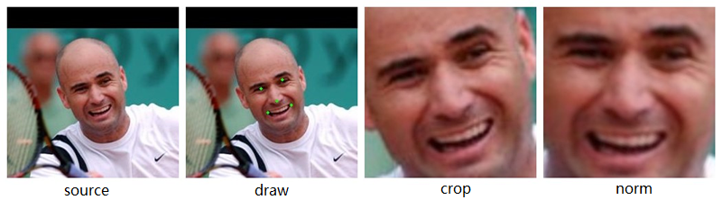

## DAFace --- Face Detection and Alignment

### Description
DAFace is an open source c++ project to deal with face image pre-process. It contains five parts:
* Detect(det)---use [SeetaFace](https://github.com/seetaface/SeetaFaceEngine) to detect face region & 5 facial points
* Clean(clean)---clean the invalid facial points data
* Draw(draw)---draw facial pionts
* Crop(crop)---crop facial region & resize to unified size
* Normalize(norm)---align face & resize to unified size

### Required
* [SeetaFace](https://github.com/seetaface/SeetaFaceEngine)
* OpenCV Library
* Boost C++ Libraries (do not need to compile)

### Compile
    mkdir build && cd build
    cmake ..
    make

### Usage
    -h [ --help ]          display help message 

      Detect      detect face region & 5 facial points
      (det)       ./proc --mode=det --src_dir=sdir [--dst_dir=ddir]
      Clean       clean the invalid facial points data
      (clean)     ./proc --mode=clean --info_file=textfile [--dst_dir=ddir]
      Draw        draw facial pionts
      (draw)      ./proc --mode=draw --info_file=textfile [--dst_dir=ddir]
      Crop        crop facial region & resize to unified size
      (crop)      ./proc --mode=crop --info_file=textfile [--dst_dir=ddir] [--new_size=256]
      Normalize   align face & resize to unified size
      (norm)      ./proc --mode=norm --info_file=textfile [--dst_dir=ddir] [--new_size=256]

    Args
    --mode arg             [required] work mode
                           currently supported: det | clean | draw | crop | norm
    --src_dir arg          [required] source directory
                           directory to store the source images
                           better to use absolute path
    --dst_dir arg          [optional] destination directory
                           directory to store the processed images
                           default: current folder
    --info_file arg        [required] information file
                           textfile to store the facial points information
    --new_size arg         [optional] unified size, effective range [64, 1280]
                           default: 256
    --parse_type arg       [optional] parse type: cmdline | config
                           parse parameters from command line or config file
                           default: cmdline
    --config_file arg      config file
                           required if parse parameters from config file

### Example

### Contact Info
If you have any problem on this project, please contact me by sending email to binlearning@163.com.
